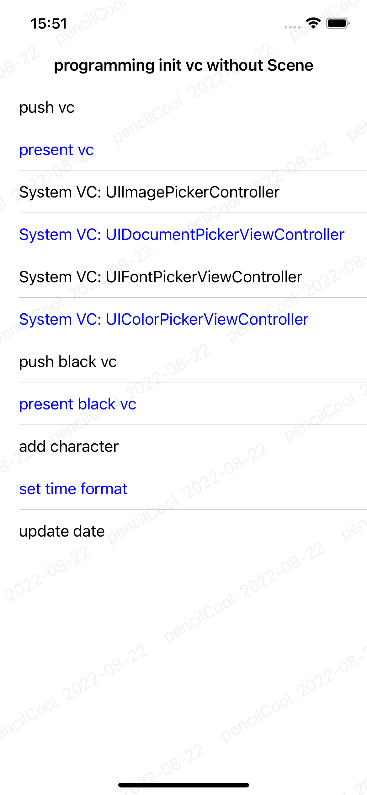

# TYHWaterMark

[](https://travis-ci.org/pencilCool/TYHWaterMark)
[](https://cocoapods.org/pods/TYHWaterMark)
[](https://cocoapods.org/pods/TYHWaterMark)
[](https://cocoapods.org/pods/TYHWaterMark)

## Example

To run the example project, clone the repo, and run `pod install` from the Example directory first.



## Requirements

## Installation

TYHWaterMark is available through [CocoaPods](https://cocoapods.org). To install
it, simply add the following line to your Podfile:

```ruby
pod 'TYHWaterMark',:git=>'https://github.com/pencilCool/TYHWaterMark.git'
```

## Author

pencilCool, yhtangcoder@gmail.com

## License

TYHWaterMark is available under the MIT license. See the LICENSE file for more info.
